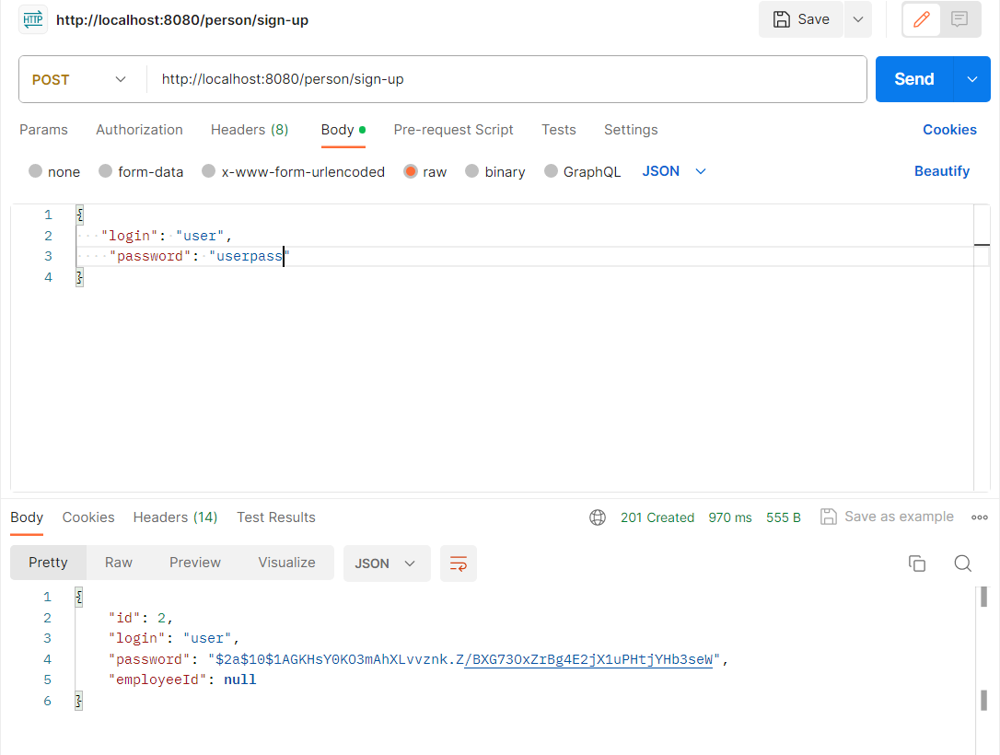
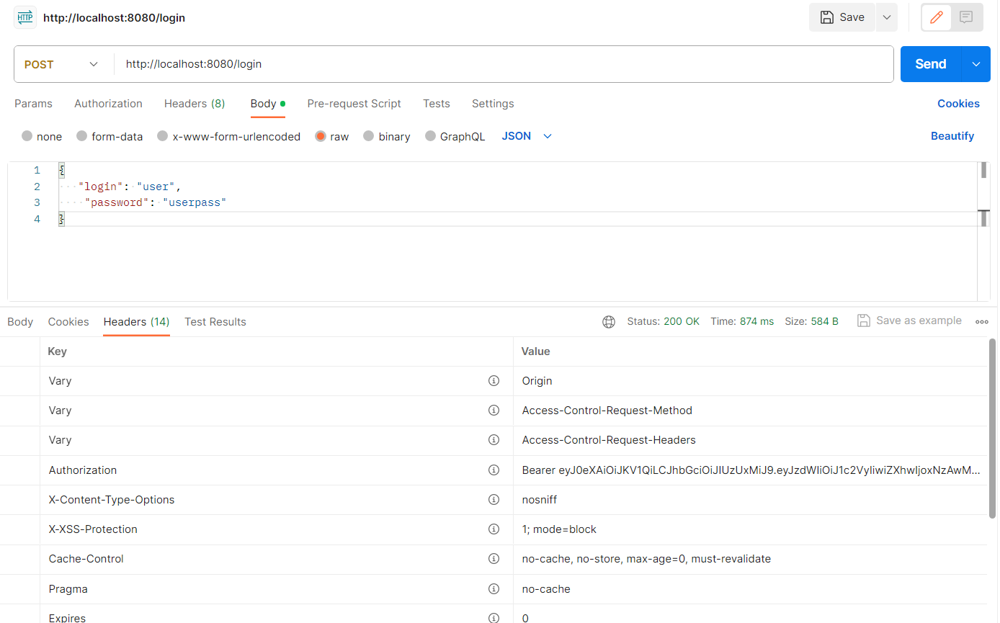
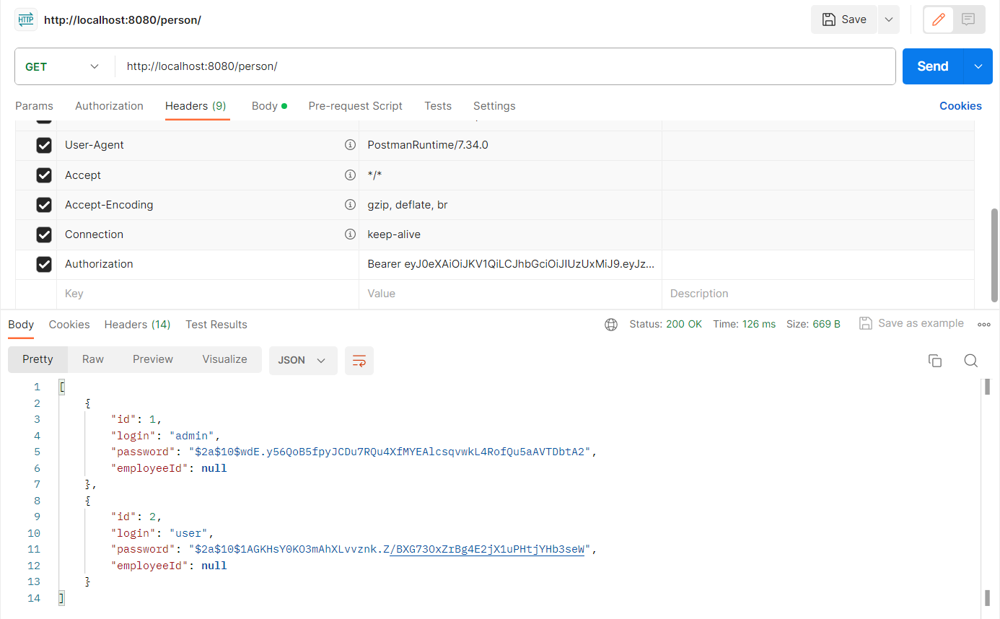

В данном проекте используется базовые технологии **Spring Rest**, 
которые включают:

* ####Авторизация **JWT**

  Регистрация пользователя

   

  Получение у пользователя токена
  

Получение всех пользователей с добавлением токена
  

* ####Обработка исключений
* ####Построения ответа HTTP запроса
* ####Валидация моделей